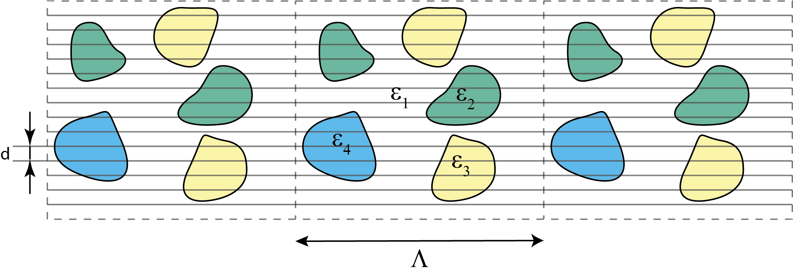
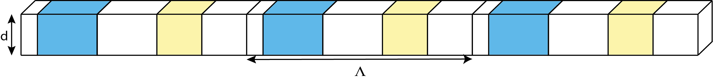

# DE_discovery

## Описание 

Репозиторий содержит код на Matlab и Python, написанный в ходе работы над выпускной квалификационной работы на тему **"Восстановление дифференциальных уравнений, описывающих распространение излучения в сильно неоднородных рассеивающих средах, методами искусственного интеллекта"** на физическом факультете Университета ИТМО.

## Цель работы

Поиск одномерных дифференциальных уравнений, описывающих распространение излучения в сильно неоднородной рассеивающей среде на основании строгих численных решений уравнений Максвелла с использованием методов искусственного интеллекта

## Введение

Изучение распространения и рассеяния электромагнитных волн в сильно неоднородных рассеивающих средах находит свое применение в различных областях физики, где возникает задача определения состава среды на основании светорассеяния/спектроскопии и некоторых предположений о составе среды. Например, в биофизике для неинвазивной диагностики биологических тканей в инфракрасном и видимом диапазонах. В науках о Земле часто приходится работать с шероховатыми рассеивающими поверхностями, такими как почва, поверхность океанов, снежный покров и растительность, для чего применяются различные методы моделирования рассеяния света. 

Существует два основных подхода к моделированию распространения электромагнитного излучения в неоднородных средах. Первый основан на точном численном решении уравнений Максвелла, второй - на использовании теории переноса излучения. Однако существующие методы имеют ряд существенных недостатков. Численные методы решения уравнений Максвелла в случае достаточно большого количества рассеивающих частиц требуют слишком большого количества вычислений. Методы, основанные на теории переноса излучения, могут быть применены только в случае достаточно низкой плотности упаковки рассеивающих частиц. Поэтому необходимы исследования более простых аппроксимаций сложной модели распространения излучения в неоднородной среде с достаточной плотной упаковкой рассеивающих частиц.

## Основная часть

### 1. Сбор данных

#### 1.1. Моделирование среды

Для моделирования двумерной неоднородной среды использовалась модель суперячейки с периодом $\Lambda$, конечной толщиной $H$, область между включениями заполнена свободным пространством $(\varepsilon_1 = 1)$. Верны следующие предельные соотношения: $\frac{H}{\lambda} \gg 1$, $\frac{\Lambda}{\lambda} \gg 1$, $\frac{l}{\lambda} \sim 1$, где $l$ - характерный линейный размер включений, $\lambda$ - длина падающей волны. Схема используемой модели приведена на рисунке ниже  

#### 1.2. Численное решение уравнений Максвелла

Для сбора данных необходимо было получить численные решения уравнений Максвелла внутри неоднородной подложки. Для этого подложка "разрезалась" на тонкие слои, как это показано на рисунке ниже  На каждом таком слое возникала задача дифракции, для решения которой в рамках модели суперячейки может быть использован Фурье-модальный метод  Применяя Фурье-модальный метод на каждом тонком слое, можно рассчитать разложение поля в ряд Фурье на произвольном расстоянии от верхней границы подложки. В качестве данных, описывающих распространение энергии в неоднородной среде, использовалось значение нулевой гармоники Фурье проекции вектора Пойнтинга на вертикальную ось.

Моделирование среды и сбор данных производился с помощью языка программирования Matlab, так как существует реализация Фурье-модального метода на этом языке программирования.

### 3. Предобработка данных

В результате численных экспериментов в качестве данных были получены значения исследуемой фунции, но не значения ее производной. К имеющимся данным необходимо было применить методы численного дифференцирования. Полученные данные предварительно сглаживались с помощью гауссова ядра. Для вычисления производных по данным формировался многочлен Чебышева, который впоследствии дифференцировался для нахождения значений производных. Также производилась перенормировка значений сетки, чтобы они находились внутри отрезка $[0; 1]$. 

### 4. Восстановление дифференциальных уравнений

Для восстановления дифференциальных уравнений, описывающих исследуемый процесс, на основе данных использовался алгоритм, объединяющий генетический алгоритм и LASSO-регрессию. Генетический алгоритм использовался для определения оптимального набора слагаемых в уравнении, а LASSO-регрессия для вычисления промежуточных значений коэффициентов и определения значимых из них. К полученной в результате работы алгоритма популяции уравнений применялась линейная регрессия для окончательного вычисления коэффициентов в уравнении. Описанный алгоритм реализован в библиотеке [EPDE](https://github.com/ITMO-NSS-team/EPDE/tree/main) для языка программирования Python.

### 5. Численное решение дифференциальных уравнений

В проекте предусмотрена возможность численного решения дифференциальных уравнений. Для получения решений использовались методы классического машинного обучения: искомая функция аппроксимировалась параметризованной моделью, затем решалась задача минимизации ошибки по набору параметров модели. Используемый алгоритм реализован в библиотеке [TEDEouS](https://github.com/ITMO-NSS-team/torch_DE_solver/tree/main) для языка программирования Python. Преимуществом использования данной библиотеки является совместимость с фреймворком [EPDE](https://github.com/ITMO-NSS-team/EPDE/tree/main), с помощью которого восстанавливались уравнения.

## Физические параметры исследуемой системы

В работе исследовалась двумерная подложка коненчной толщины с диэлектрическими включениями с одинаковыми значениями радиусов и диэлектрических проницаемостей, имеющая периодичность вдоль горизонтальной оси $Ox$ и расположенная в свободном пространстве. Падающая на подложку волна распространялась вдоль вертикальной оси $Oy$. Общая схема исследуемой системы представлена на рисунке ниже  Падающее на исследуемую структуру поле представляло собой TE-поляризованную плоскую монохроматическую волну, длина волны которой составляла $\lambda = 0.5 \text{ мкм}$. Полная толщина $H = 50 \text{ мкм}$ ($\frac{H}{\lambda} = 100$ в безразмерных единицах), период $\Lambda = 15 \text{ мкм}$ ($\frac{\Lambda}{\lambda} = 30$ в безразмерных единицах). Область между цилиндрическими включениями заполнена свободным пространством с диэлектрической проницаемостью $\varepsilon_{1} = 1$. Диэлектрическая проницаемость включений составляет $\varepsilon_{2} = 4$. Плотность упаковки включений составляла $n = \widetilde{n} \cdot \pi r_{0}^{2} = 0.3$, где $\widetilde{n}$ - концентрация рассеивающих частиц. Радиусы цилиндров были одинаковыми в ходе каждого запуска, в общем случае включения внутри подложки могут иметь разные радиусы. На этапе расчета поля внутри подложки с помощью Фурье-модального метода учитывалось $N = 150$ гармоник Фурье.

## Пример результатов

Уравнение, восстановленное по данным, для значения радиуса $r_0 = 0,1 \text{ мкм}$

$$\frac{dI}{dH} = - 0.025 - 39.643 \cdot I$$

Уравнение имеет граничное условие $I_{0, y}(0) = -1$. График численного решения и тестовые данные, а также ошибка на тестовой выборке приведены на рисунке ниже

